# Agentic AI eBook – LangGraph RAG Chatbot

A production-style interview assignment implementing a **Retrieval-Augmented Generation (RAG)** chatbot in Python. The chatbot answers questions **strictly from the supplied Agentic AI eBook**, returns the retrieved source chunks, and provides a confidence score.

**Knowledge base:** `https://konverge.ai/pdf/Ebook-Agentic-AI.pdf`

## Requirements covered

| Assignment requirement | Implementation |
|---|---|
| Ingest the PDF | `scripts/download_pdf.py` + `scripts/ingest.py` |
| Chunk the text | `RecursiveCharacterTextSplitter` |
| Generate embeddings | `sentence-transformers/all-MiniLM-L6-v2` |
| Store embeddings | Pinecone serverless index |
| LangGraph RAG pipeline | `app/graph.py` |
| Retrieve relevant chunks | Pinecone cosine similarity search |
| Generate answer using LLM | Qwen by default; Grok also supported |
| Strict PDF grounding | similarity gate + grounded prompt + grading node + retry/refusal |
| API | FastAPI `/chat` endpoint |
| Optional UI | Streamlit chat UI |
| Final answer | returned by `/chat` |
| Retrieved context | returned in `context_chunks` |
| Confidence/score | returned as `confidence` |
| Sample queries | `sample_queries.md` |
| Architecture explanation | `architecture.md` + diagram below |
| Tests | `pytest` test suite |

---

## Architecture

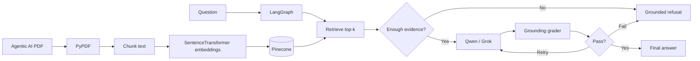

The graph is intentionally more than a simple `retrieve → LLM` chain. It has conditional routing, an evidence threshold, a grounding evaluator, one controlled retry, and a deterministic refusal path.

---

## Project structure

```text
agentic-ai-rag-chatbot/
├── app/
│   ├── __init__.py
│   ├── config.py
│   ├── embeddings.py
│   ├── graph.py
│   ├── llm.py
│   ├── main.py
│   ├── pdf_loader.py
│   ├── prompts.py
│   ├── schemas.py
│   ├── scoring.py
│   ├── service.py
│   └── vector_store.py
├── data/
│   └── .gitkeep
├── scripts/
│   ├── __init__.py
│   ├── ask.py
│   ├── download_pdf.py
│   └── ingest.py
├── tests/
│   ├── test_llm_json.py
│   ├── test_pdf_chunking.py
│   └── test_scoring.py
├── .env.example
├── .gitignore
├── Dockerfile
├── architecture.md
├── requirements.txt
├── sample_queries.md
├── streamlit_app.py
└── README.md
```

---

# Setup

## 1. Clone and enter the repository

```bash
git clone <your-github-repository-url>
cd agentic-ai-rag-chatbot
```

## 2. Create a virtual environment

### Windows

```powershell
python -m venv venv
venv\Scripts\activate
```

### Linux/macOS

```bash
python3 -m venv venv
source venv/bin/activate
```

## 3. Install dependencies

```bash
pip install -r requirements.txt
```

> The first run of the SentenceTransformer model downloads the embedding model and caches it locally.

## 4. Create `.env`

### Windows

```powershell
copy .env.example .env
```

### Linux/macOS

```bash
cp .env.example .env
```

Fill in:

```env
LLM_PROVIDER=qwen
QWEN_API_KEY=your_key_here

PINECONE_API_KEY=your_key_here
```

The default Qwen configuration uses the international OpenAI-compatible endpoint:

```env
QWEN_BASE_URL=https://dashscope-intl.aliyuncs.com/compatible-mode/v1
QWEN_MODEL=qwen-plus
```

If your Alibaba Cloud account uses a workspace-specific Singapore endpoint, replace `QWEN_BASE_URL` with that compatible-mode URL.

### Optional: use Grok instead

```env
LLM_PROVIDER=grok
XAI_API_KEY=your_xai_key
XAI_BASE_URL=https://api.x.ai/v1
XAI_MODEL=grok-4.6
```

No code changes are needed.

---

# Build the knowledge base

## 5. Download the supplied eBook

```bash
python -m scripts.download_pdf
```

This saves the PDF to:

```text
data/Ebook-Agentic-AI.pdf
```

The PDF itself is intentionally not committed to this repository; the script downloads it from the assignment's public source URL.

## 6. Ingest into Pinecone

```bash
python -m scripts.ingest --reset
```

This performs:

1. PDF text extraction
2. page-preserving chunking
3. local embedding generation
4. Pinecone index creation if needed
5. vector upsert with text/page metadata

For future re-ingestion without clearing the namespace:

```bash
python -m scripts.ingest
```

---

# Run the API

```bash
uvicorn app.main:app --reload
```

Open:

```text
http://127.0.0.1:8000/docs
```

FastAPI Swagger lets the reviewer test the chatbot directly.

## Health endpoint

```bash
curl http://127.0.0.1:8000/health
```

## Chat endpoint

```bash
curl -X POST "http://127.0.0.1:8000/chat" \
  -H "Content-Type: application/json" \
  -d "{\"question\":\"What is Agentic AI?\"}"
```

Example response shape:

```json
{
  "question": "What is Agentic AI?",
  "answer": "According to the eBook, ... [p. 6]",
  "confidence": 0.84,
  "grounded": true,
  "context_chunks": [
    {
      "chunk_id": "abc123...",
      "page": 6,
      "score": 0.78,
      "content": "Retrieved text from the PDF..."
    }
  ],
  "provider": "qwen",
  "model": "qwen-plus"
}
```

For a question without sufficient evidence, the application returns:

```text
I could not find sufficient information in the provided Agentic AI eBook to answer this question.
```

---

# Run the Streamlit UI

Keep FastAPI running in one terminal.

In a second terminal:

```bash
streamlit run streamlit_app.py
```

Open the URL displayed by Streamlit, normally:

```text
http://localhost:8501
```

The UI displays:

- generated answer
- confidence
- grounded status
- LLM model
- retrieved chunks
- source page numbers
- similarity scores

---

# Terminal-only test

After ingestion:

```bash
python -m scripts.ask "What is Agentic AI?"
```

---

# LangGraph workflow

```text
START
  ↓
normalize_question
  ↓
retrieve
  ↓
assess_context
  ├── insufficient evidence → refuse → END
  ↓
generate_answer
  ↓
grade_grounding
  ├── grounded → finalize → END
  ├── failed + retry available → generate_answer
  └── failed after retries → refuse → END
```

The state is defined with `TypedDict`, and routing uses `add_conditional_edges`.

---

# Grounding strategy

The assignment specifically requires answers to be based strictly on the PDF. This repository uses several safeguards.

### 1. Retrieval similarity gate

Only chunks at or above `MIN_SIMILARITY` are treated as evidence.

### 2. Strict generation prompt

The LLM is explicitly prohibited from using external knowledge and is instructed to cite PDF pages.

### 3. Grounding evaluator

A second LLM call checks the generated answer against the retrieved context only.

### 4. Controlled retry

If grounding fails, the generator gets one stricter retry by default.

### 5. Refusal

If evidence is missing or the answer still fails grounding, the application returns a fixed document-only refusal.

This does not mathematically guarantee zero hallucinations, but it is substantially stricter than a basic RAG chain.

---

# Confidence score

`confidence` is an **application heuristic**, not a statistical probability.

It combines:

- retrieval quality based on Pinecone cosine scores
- grounding evaluator score

If the answer fails grounding, confidence is heavily penalized.

The raw retrieval scores are also returned with each context chunk for transparency.

---

# Configuration

Important `.env` values:

```env
TOP_K=5
MIN_SIMILARITY=0.25
MIN_GROUNDING_SCORE=0.75
MAX_GENERATION_ATTEMPTS=2
CHUNK_SIZE=900
CHUNK_OVERLAP=150
```

If retrieval is too strict/loose for the PDF, tune `MIN_SIMILARITY` after checking sample queries.

---

# Tests

Run:

```bash
pytest -q
```

Tests cover:

- confidence calculations
- LLM JSON parsing
- PDF loader error handling

You should also manually run the six questions in `sample_queries.md` plus the out-of-scope grounding test.

---

# API contract

## `POST /chat`

Request:

```json
{
  "question": "What are the key capabilities of Agentic AI?"
}
```

Response fields:

| Field | Meaning |
|---|---|
| `question` | normalized user question |
| `answer` | final grounded answer or refusal |
| `confidence` | combined retrieval/grounding heuristic |
| `grounded` | whether answer passed the grounding check |
| `context_chunks` | top Pinecone retrieval results |
| `provider` | `qwen` or `grok` |
| `model` | configured model |

## `GET /health`

Returns non-secret configuration information.

## `GET /stats`

Returns Pinecone index statistics.

---

## Screenshots

### Streamlit Chat Interface

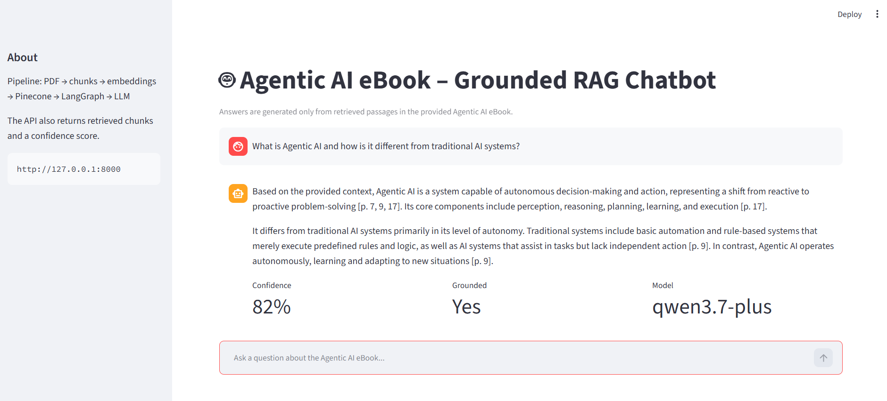

### Grounded Answer with Retrieved Context

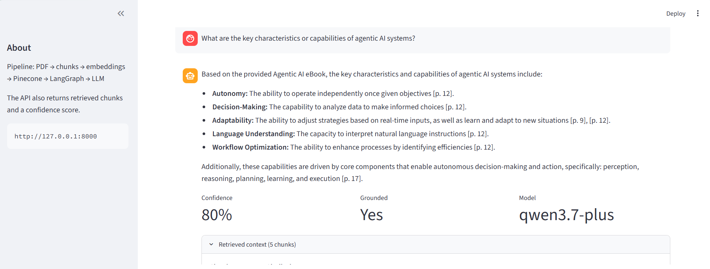


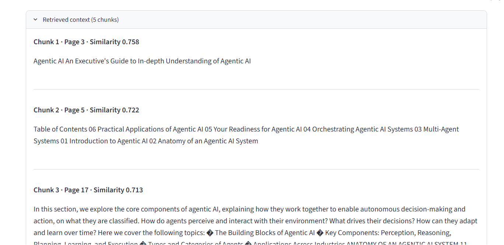


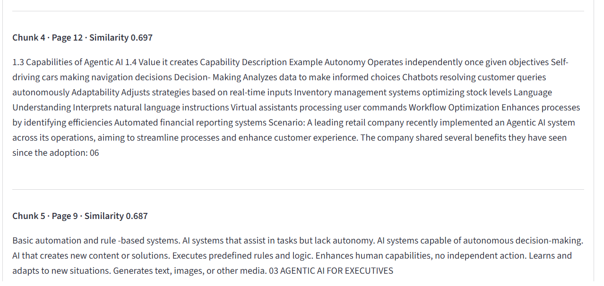


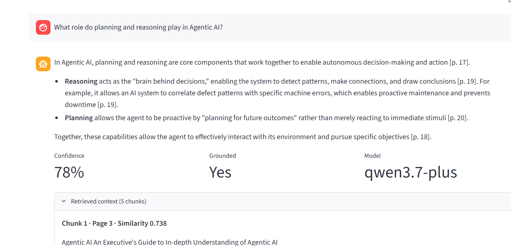

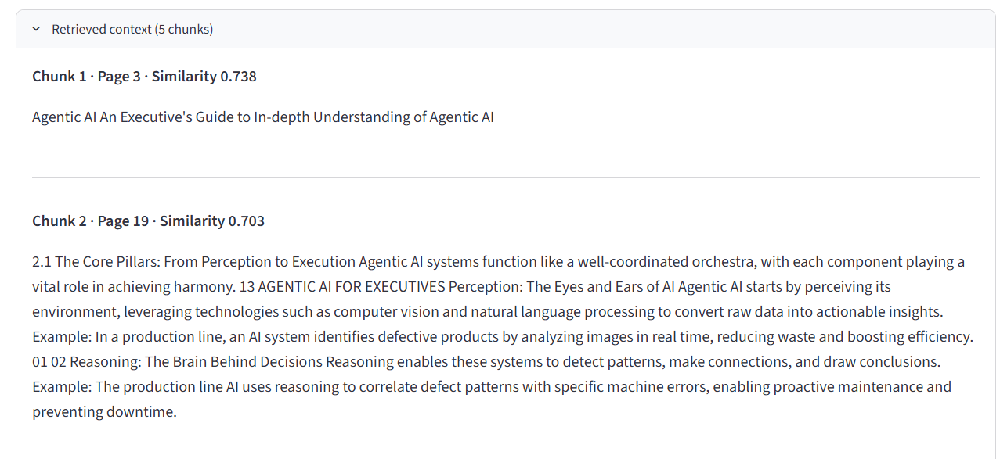

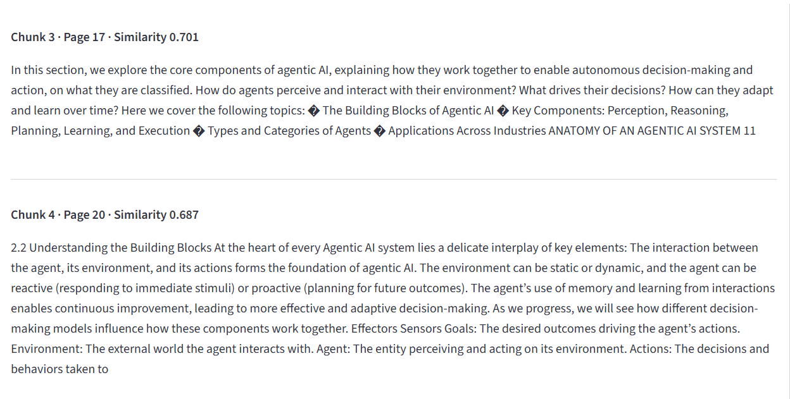

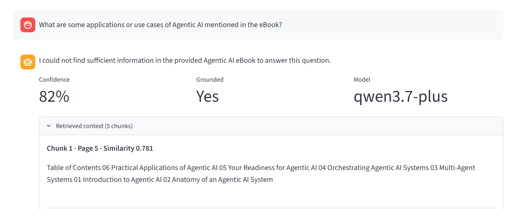

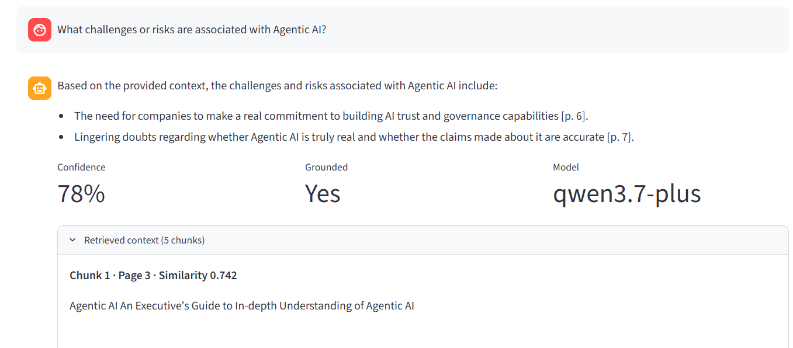

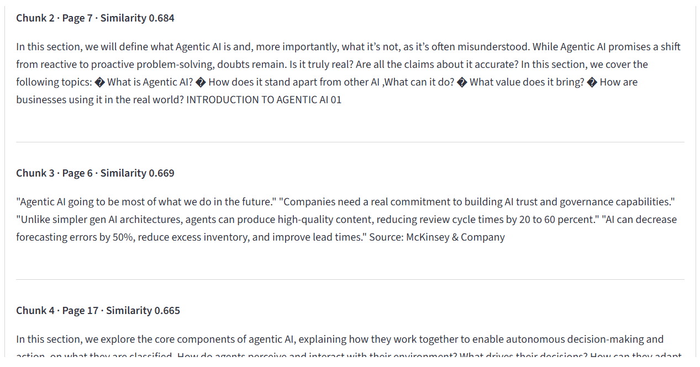

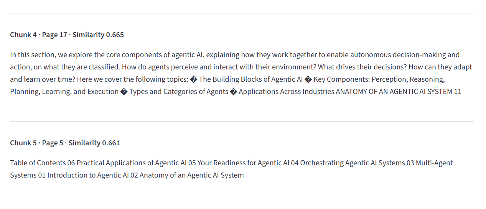


---

# Notes

- API keys are never hard-coded.
- `.env` is ignored by Git.
- The source PDF is downloaded from the assignment URL instead of being redistributed in the repository.
- Page metadata is preserved during chunking.
- Embeddings are generated locally with SentenceTransformers.
- Pinecone is used as the vector database.
- Both Qwen and Grok use OpenAI-compatible clients, keeping provider switching simple.

For additional design details, see [`architecture.md`](architecture.md).
