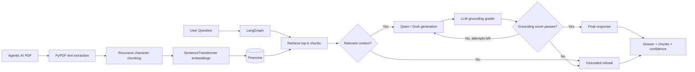

# Architecture

## High-level flow

## LangGraph state

The graph carries:

- `question`
- `retrieved_contexts`
- `relevant_contexts`
- `retrieval_confidence`
- `answer`
- `grounded`
- `grounding_score`
- `confidence`
- `generation_attempts`

## Nodes

1. **normalize_question** — sanitizes the user question.
2. **retrieve** — embeds the question and queries Pinecone.
3. **assess_context** — filters weak retrieval results using `MIN_SIMILARITY`.
4. **generate_answer** — instructs the LLM to use only supplied passages and page numbers.
5. **grade_grounding** — separately checks whether the answer is supported by the retrieved context.
6. **finalize** — combines retrieval and grounding signals into a confidence score.
7. **refuse** — returns a deterministic document-only fallback when evidence is insufficient.

## Why the grounding check matters

A normal RAG chain can still hallucinate even when useful context is retrieved. This project adds a second LLM evaluation step and a retry path. If the answer still does not pass the configured grounding threshold, the system refuses instead of returning an unsupported answer.

## Confidence score

The returned confidence is a **heuristic application score**, not a calibrated probability.

It combines:

- cosine-similarity retrieval quality, and
- the grounding evaluator score.

Ungrounded/refused responses are intentionally assigned a low confidence.
